# CIFAR-10 CNN Ablation Study

A systematic hyperparameter ablation study on a small CNN trained on CIFAR-10 (50k images, 10 classes, 32x32 px). Each experiment batch fixes all variables except one, then measures val/loss and val/acc after 30 epochs.

## Architecture

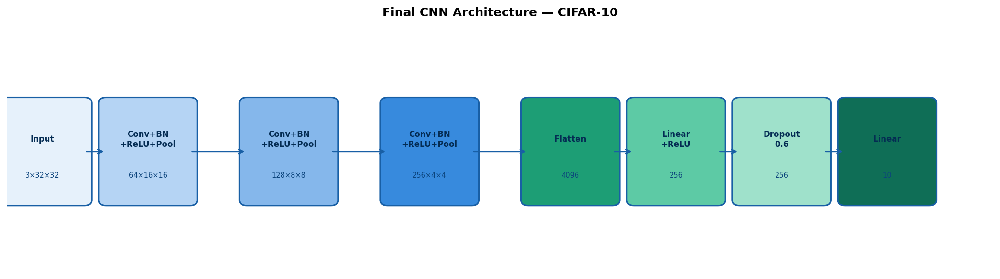

## Experiments

| # | Variable | Values Tested | Winner |
|---|----------|---------------|--------|
| 1 | Scheduler | none, step, cosine, plateau, warmup_cosine | **step** |
| 2 | Filter width | [16,32,64,128], [32,64,128,256], [64,128,256,512] | **[32,64,128,256]** |
| 3 | Depth | 1, 2, 3, 4 blocks | **3** |
| 4 | Kernel size | 3, 5, 7 | **3** |
| 5 | Dropout | 0.1, 0.3, 0.5, 0.6, 0.7 | **0.5-0.6** |

## Best Configuration

```python
filters    = [64, 128, 256]
depth      = 3
kernel     = 3
scheduler  = "step" (StepLR, step=10, gamma=0.1)
optimizer  = "adam"
lr         = 3e-4
dropout    = 0.5-0.6
epochs     = 30
batch_size = 64
```

**Best val/acc: ~83%**

## Overview (all experiments)

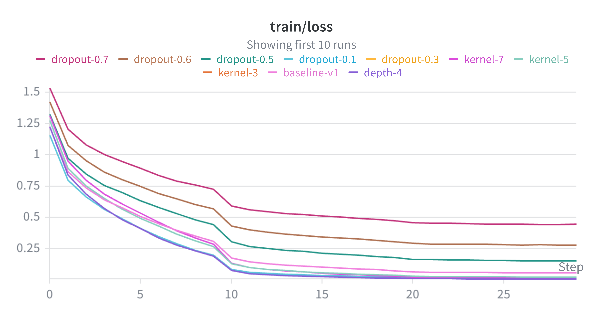
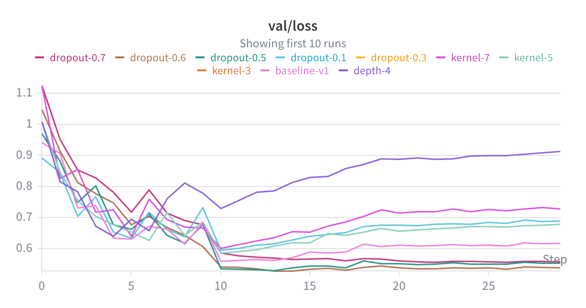
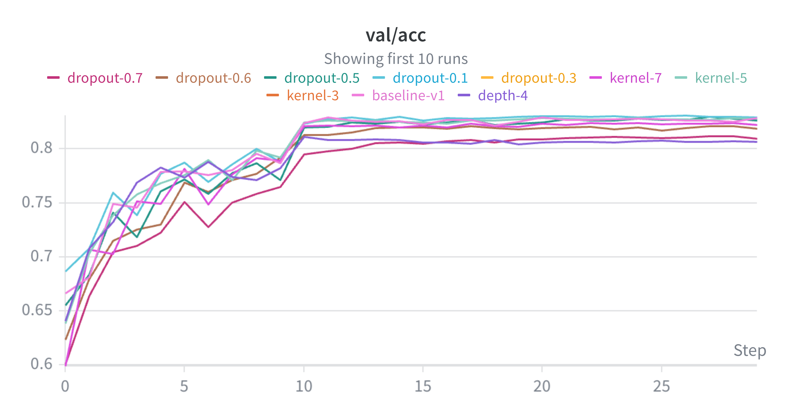

## Key Findings

### Scheduler

At 30 epochs, discrete LR drops (StepLR) outperform smooth decay schedules. `sched-step` achieved the lowest val/loss (~0.64) and stabilized after epoch 15, while `sched-none`, `sched-cosine`, and `sched-warmup_cosine` all showed signs of overfitting. Cosine annealing needs 60+ epochs to show its real advantage — at shorter training budgets, a simple step decay is the pragmatic choice.

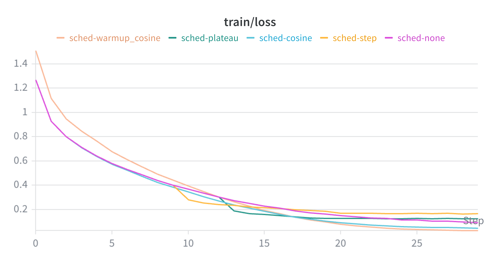
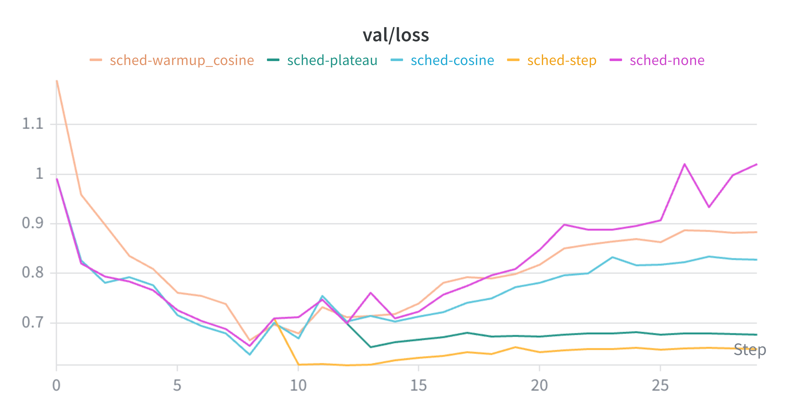
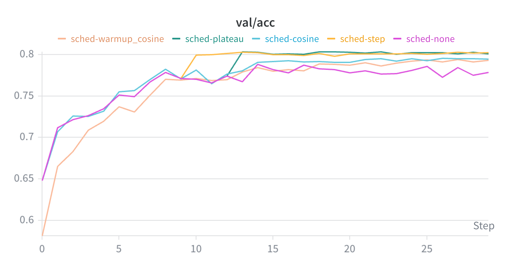

### Filter Width

Diminishing returns above 256 filters for CIFAR-10 at 32x32. Going from 128 to 256 max filters gave a meaningful +4% val/acc bump, but 256 to 512 only added +2%. Beyond 256, model capacity is no longer the bottleneck — the bottleneck shifts to data augmentation and regularization. The extra parameters from 512 filters aren't worth the compute.

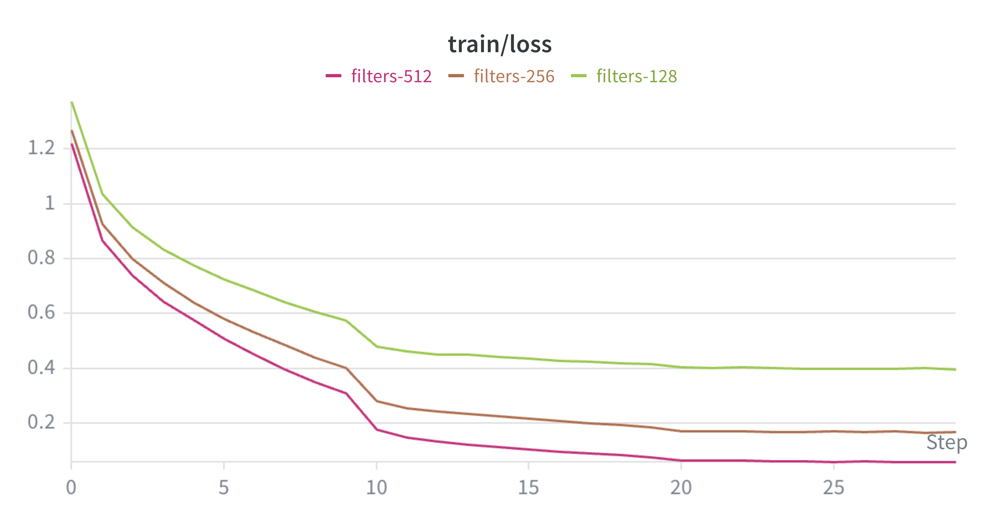
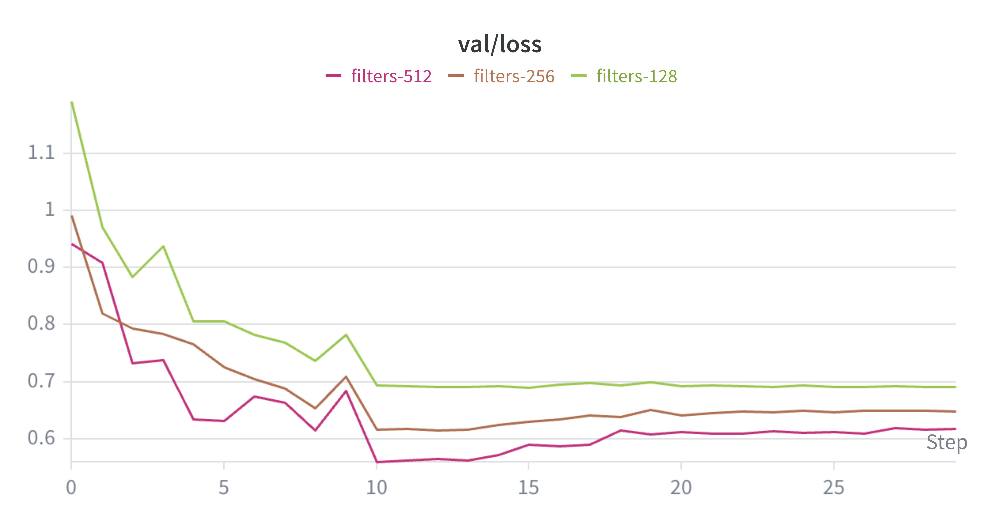
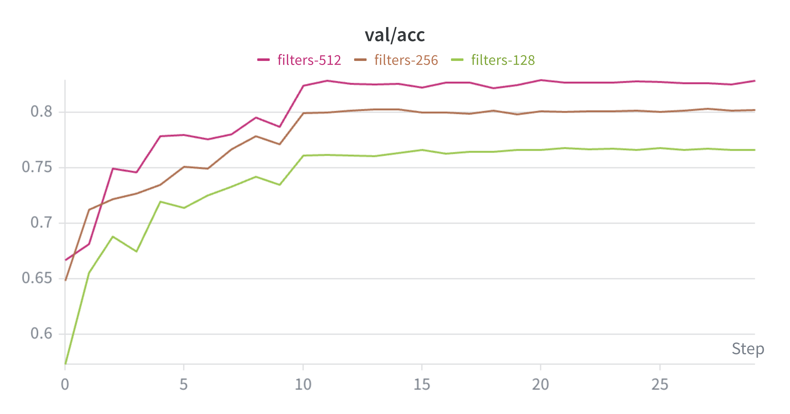

### Depth

depth=3 is the sweet spot for 32x32 images, hitting ~81% val/acc with stable convergence. depth=4 overfits due to a resolution-depth mismatch: four pooling layers compress a 32x32 image down to 2x2 final spatial resolution, which destroys too much information. depth=1 (70%) and depth=2 (78%) simply lack the capacity to learn enough features.

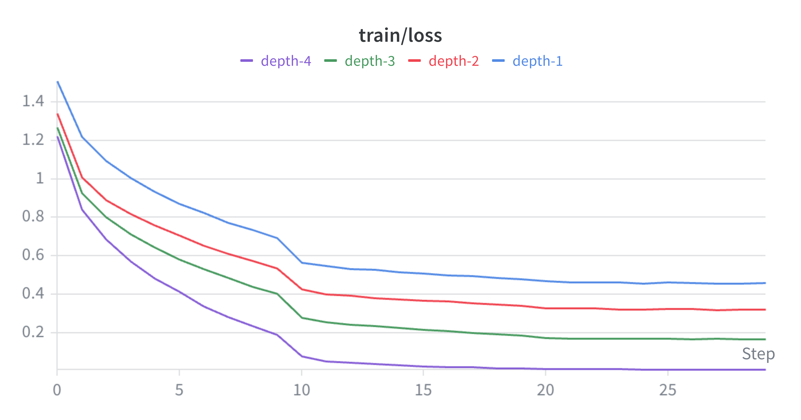
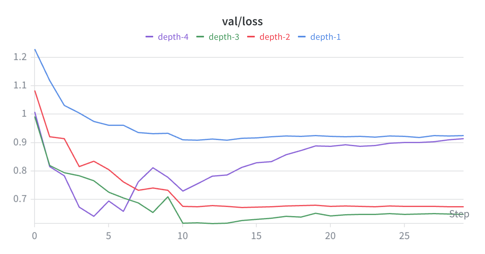
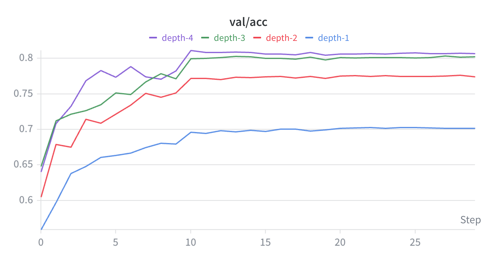

### Kernel Size

Kernel size has minimal impact on val/acc at 32x32 resolution, but kernel=3 wins clearly on val/loss and parameter efficiency. CIFAR-10 images lack the fine-grained texture that larger kernels could exploit — bigger kernels just add parameters without adding useful signal. For small images, use kernel=3 always; kernel=5 or 7 are only worth exploring at 224x224+.

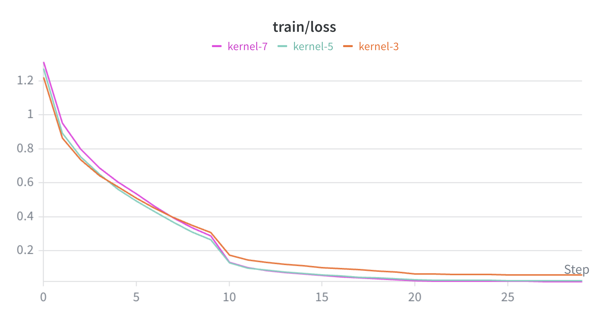
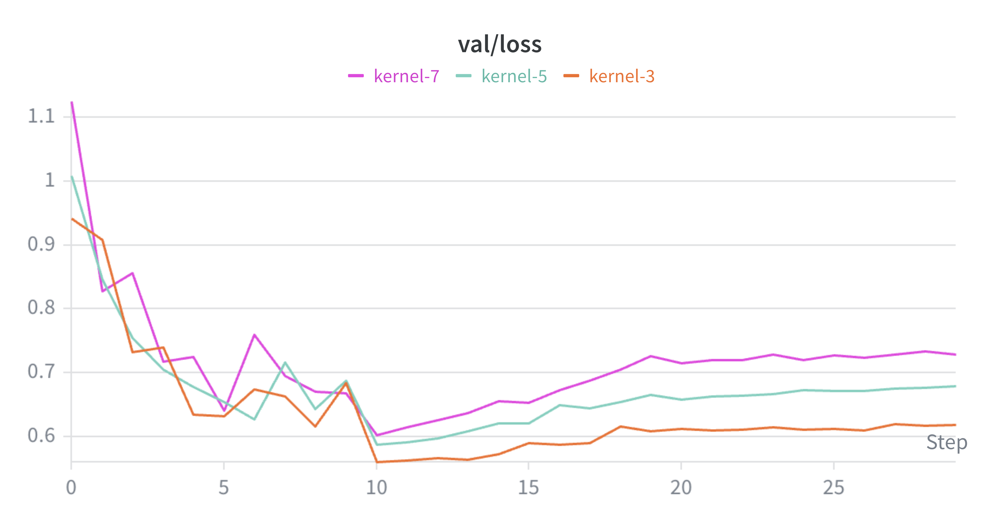
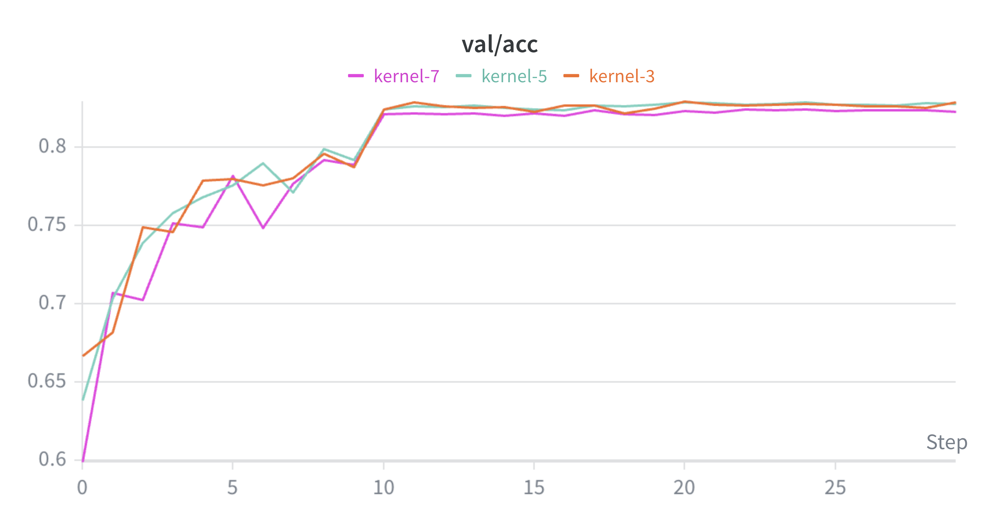

### Dropout

Dropout follows an inverted-U curve for this architecture. The peak is around 0.5-0.6, which achieved the lowest val/loss while maintaining competitive val/acc. Below 0.5 the model is underregularized (val/loss climbs, less calibrated predictions). Above 0.6 it becomes overregularized (train loss stays too high, model is undertrained at 30 epochs). The standard dropout=0.3 is suboptimal for larger models on small datasets — empirical search matters here.

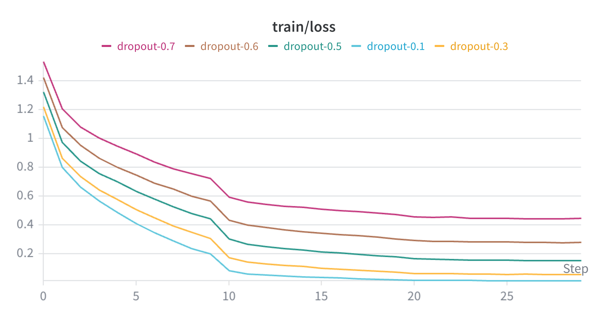
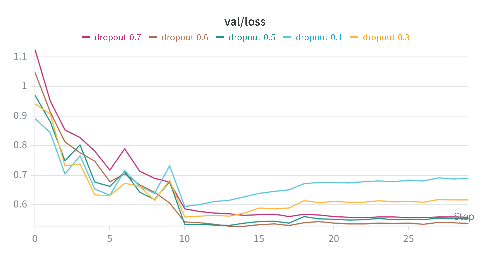
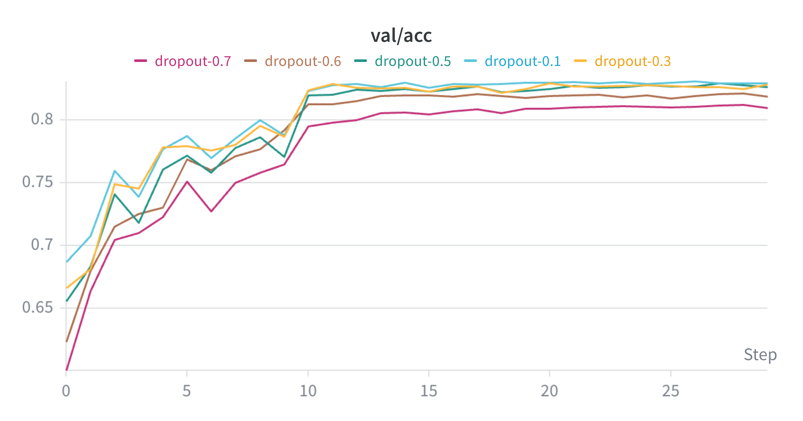

## What's Next

- Data augmentation (RandomCrop, HorizontalFlip, ColorJitter)
- Residual connections
- Transfer learning baseline

## Tracking

Experiments tracked with [Weights & Biases](https://wandb.ai) under project [`cifar10-cnn-study`](https://wandb.ai/samartharora176-/cifar10-cnn-study).

## Setup

```bash
pip install torch torchvision wandb matplotlib seaborn opencv-python
```

Download CIFAR-10 automatically on first run via `torchvision.datasets.CIFAR10(download=True)`.
