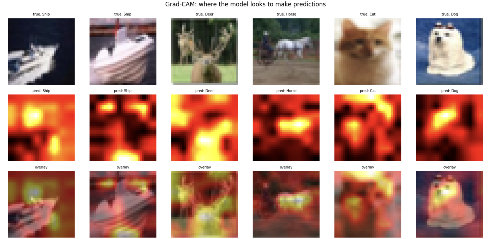

# Demystifying CNNs: What Actually Happens When You Change a Hyperparameter

## Why I wrote this

Since college I'd been following deep learning tutorials — copy the architecture, run the code, get the expected result. It worked. But I never really understood *why*.

Why kernel=3 and not kernel=5? Why dropout=0.3 and not 0.5? Why does the loss curve look like *that*?

Every time I changed something it felt like turning a dial in the dark. Sometimes the number went up. Sometimes down. Never understood. The hyperparameters felt mystical.

This project is my attempt to turn the lights on.

I picked CIFAR-10 — small enough to run 20+ experiments in a weekend, complex enough to actually learn from. I followed [Karpathy's neural network training recipe](http://karpathy.github.io/2019/04/25/recipe/) as my north star. I tracked everything in [Weights & Biases](https://wandb.ai/samartharora176-/cifar10-cnn-study). The rule was simple: change one variable at a time, measure everything, understand the result before moving on.

What follows is what I found.

[GitHub repo](https://github.com/SamarthAroraa/cifar10-cnn-ablation) | [W&B project](https://wandb.ai/samartharora176-/cifar10-cnn-study)

---

## The Setup

### The dataset

CIFAR-10. 10 classes, 50,000 training images, 32x32 pixels each. Airplanes, automobiles, birds, cats, deer, dogs, frogs, horses, ships, trucks. Human baseline accuracy is ~94% — that's the ceiling we're chasing.

Small images. Tiny, actually. Each one is 32 pixels wide. You're squinting at a postage stamp and trying to tell a cat from a dog. That constraint shapes every architectural decision that follows.

### What I explored before writing a single line of model code

I wanted to understand the data before asking a model to understand it. Here's what I found:

**Class distribution** — perfectly balanced. 5,000 images per class. No resampling needed, no class weights. One less thing to worry about.

**Per-channel pixel stats** — this is where your normalization constants come from. Not from a textbook. From *your* data:
```
R: mean=0.4914  std=0.2470
G: mean=0.4822  std=0.2435
B: mean=0.4465  std=0.2616
```

**Average image per class** — I averaged all 5,000 images for each class. The average car is a blobby vehicle shape against grey. The average ship is blue-heavy — water dominates. The average frog is a green blob. These averages tell you what *structural* signal exists per class and what the model has to work with.

**Class similarity matrix** — I computed cosine similarity between class-mean images. Cat and dog are the most similar pair. Automobile and truck are close. Ship and airplane share blue backgrounds. This predicted my confusion matrix before I trained a single model. A dog is least similar to a truck. Makes sense.

**Spatial brightness heatmap** — subjects are centered in CIFAR-10. The middle of every image is brighter on average. This told me random crops and flips would be important future augmentations — the model needs to learn position invariance that the data doesn't naturally provide.

### The base architecture


Three convolutional blocks, each doing the same thing: Conv -> BatchNorm -> ReLU -> MaxPool. Progressive spatial summarization: 32x32 -> 16x16 -> 8x8 -> 4x4. Then a classifier head: Flatten -> Linear(256) -> ReLU -> Dropout -> Linear(10).

Nothing fancy. That's the point. I wanted a simple enough architecture that when I changed one thing, I could actually understand *why* the result changed.

### How experiments were structured

One variable at a time. Everything else fixed. Seed=42 for reproducibility. All runs logged to W&B with a config dict pattern. Five study batches, run in sequence — each one builds on the confirmed best from the previous study.

---

## Before Training: Karpathy's Sanity Checks

I used to just call `model.fit()` and hope for the best. Karpathy's recipe changed how I think about training. Before running a single real experiment, I ran every new architecture through these checks:

**Check 1 — Loss at initialization.** With 10 classes and a randomly initialized softmax, you expect `-log(1/10) = 2.302`. My model gave 2.323. Close enough. If this number is wildly off, your final layer is broken and nothing downstream will make sense.

**Check 2 — Overfit one batch.** I took 8 images, threw them at the model, and trained until the loss hit zero. If your model can't memorize 8 examples, something is fundamentally broken — wrong loss function, bad data pipeline, shape mismatch. My model got to 0.000007 loss in ~150 steps. Passed.

These checks take 30 seconds and have saved me hours. I run them every time now. Every result in this study came from a verified pipeline. That's the point of the recipe.

---

## Experiment 1 — Learning Rate Schedulers

### What I expected

I expected cosine annealing to win. It's the trendy choice. Every recent paper uses it. The smooth decay feels mathematically elegant.

I was wrong.

### What schedulers actually do

Without a scheduler, your learning rate is constant throughout training. That's like hiking downhill with the same stride length the entire way — works early when you need to cover ground, terrible late when you need precision near the bottom. Schedulers reduce the learning rate over time so the model can make finer adjustments as it converges.

I tested five:
- **none** — constant LR, no decay
- **step** — drop LR by 10x every 10 epochs
- **cosine** — smooth cosine decay to zero
- **plateau** — drop LR when val/loss stops improving
- **warmup_cosine** — ramp up for 5 epochs, then cosine decay

### What actually happened


The first 10 epochs are nearly identical across all five schedulers. Early training is dominated by the data signal, not the learning rate. The model is learning "what is an edge" and "what is a color blob" — big, obvious features that any reasonable LR will pick up.

The divergence happens after epoch 10.

`sched-none` shows textbook overfitting after epoch 15. Val/loss rising while train/loss falls — the model is memorizing, not generalizing. Without a scheduler, there's nothing to slow it down.

`sched-step` wins. Lowest val/loss (~0.64), stable after epoch 15. The discrete LR drop at epoch 10 acts like a hard reset — the model was bouncing around a minimum, and the sudden 10x LR reduction lets it settle in.

`sched-cosine` looked promising but decayed too aggressively for a 30-epoch budget. It needs a longer runway — 60+ epochs — to show its real advantage. At 30 epochs, it's still in the middle of its decay when training ends.

### What I learned

Cosine is theoretically elegant but practically needs a longer runway. At 30 epochs, discrete drops outperform smooth decay. The right scheduler depends on your epoch budget, not on what's trending on arXiv.

**Winner: step. Used for all remaining experiments.**

---

## Experiment 2 — Filter Width

### What I expected

More filters = more capacity = better accuracy. I expected the widest network to win by a clear margin.

I was half right.

### The doubling rule

There's a reason we double filter count after each pooling layer. Spatial resolution halves (32x32 -> 16x16), so we double channels (64 -> 128) to preserve information capacity. The total number of activations stays roughly constant through the network. It's not arbitrary — it's information conservation.

I tested three widths:
- Narrow: [16, 32, 64, 128]
- Baseline: [32, 64, 128, 256]
- Wide: [64, 128, 256, 512]

### What actually happened


```
128 max filters:  ~76-77% val/acc
256 max filters:  ~80-81% val/acc   (+4%)
512 max filters:  ~82-83% val/acc   (+2%)
```

Going from 128 to 256 max filters gave a meaningful +4% val/acc bump. Going from 256 to 512 only added +2% — with roughly 4x more parameters. In a production context, that doubles your model size and inference cost for a marginal gain. The efficiency frontier is at 256.

### What I learned

More capacity helps — until it doesn't. Above 256 filters, the bottleneck shifts from model capacity to data quality. You'd get more from augmentation than from wider layers. The model has enough neurons to represent the patterns; it just doesn't have enough diverse training examples to learn them robustly.

**Winner: [32, 64, 128, 256] for the accuracy/compute tradeoff. Used [64, 128, 256] (depth=3) going forward.**

---

## Experiment 3 — Depth

### What I expected

I expected depth=4 to be the sweet spot. Four blocks, four pooling layers, maximum feature hierarchy. The standard "deeper is better" intuition.

This is the experiment that taught me the most.

### The resolution-depth constraint

This is the concept most tutorials skip entirely. You can't add unlimited depth without eventually destroying spatial information. Every MaxPool(2) halves your spatial dimensions. The math is simple:

```
depth=1:  32 / 2^1 = 16x16 final spatial
depth=2:  32 / 2^2 = 8x8
depth=3:  32 / 2^3 = 4x4   <-- sweet spot
depth=4:  32 / 2^4 = 2x2   <-- too aggressive
```

At depth=4, you're compressing a 32x32 image down to 2x2 before the classifier even sees it. That's 4 pixels. Four. You've thrown away almost everything.

### What actually happened


depth=4 has the lowest training loss. It fits the training data beautifully. But val/loss rises after epoch 15. That train/val gap is the signature of memorization, not learning.

depth=1 (70% val/acc) and depth=2 (78%) simply lack the capacity to learn enough features. depth=3 hits ~81% with stable convergence and a 4x4 final spatial resolution that preserves enough information for the classifier to work with.

### What I learned

Depth is constrained by input resolution. The architecture that works for ImageNet at 224x224 doesn't directly transfer to CIFAR-10 at 32x32. depth=3 is not just empirically best — it's architecturally correct for this image size. Understanding the math behind `32 / 2^depth` matters more than grid-searching blindly.

**Winner: depth=3.**

---

## Experiment 4 — Kernel Size

### What I expected

I expected kernel=5 to at least compete with kernel=3. A 5x5 kernel sees more context per layer. More context should mean better features. Right?

I was wrong.

### The receptive field argument

After stacking three layers, here's the effective receptive field for each kernel size:

```
           kernel=3    kernel=5    kernel=7
layer 1:   3x3         5x5         7x7
layer 2:   7x7         13x13       19x19
layer 3:   15x15       25x25       31x31
```

With kernel=7, by layer 3 a single neuron already sees 31 of 32 pixels. The model loses the ability to detect local features from layer 1 onwards. It's looking at nearly the whole image from the very first layer — there's no spatial hierarchy left to learn.

### What actually happened


All three kernels land at roughly the same val/acc (~82-83%). But kernel=3 wins clearly on val/loss (0.56 vs 0.67 vs 0.72) with far fewer parameters. The parameter count difference is stark:

```
kernel=3:  fewer parameters, lowest val/loss
kernel=5:  2.6x more parameters, same accuracy
kernel=7:  4.9x more parameters, same accuracy
```

Same accuracy. Fraction of the compute.

### What I learned

The kernel=3 default in modern architectures isn't arbitrary. It's the right choice for small images. Two stacked 3x3 convolutions give you a 5x5 receptive field anyway — with more nonlinearity and fewer parameters. For CIFAR-10 at 32x32, there simply isn't enough fine-grained texture for larger kernels to exploit.

**Winner: kernel=3.**

---

## Experiment 5 — Dropout

### What I expected

dropout=0.3. It's in every tutorial. It's the default in half the codebases I've read. It's almost certainly right.

Right?

### What actually happened

I tested 0.1, 0.3, 0.5, 0.6, and 0.7.


This was my most surprising finding.

```
dropout:  0.1    0.3    0.5    0.6    0.7
val/loss: 0.69   0.61   0.53   0.52   0.55
val/acc:  83.1%  82.9%  82.8%  82.1%  81.2%
```

The val/loss curve forms an inverted U. 0.5-0.6 achieves the lowest val/loss — not 0.3. The model is best *calibrated* (most confident when right, least confident when wrong) at higher dropout than the tutorial default.

### Why this makes sense in retrospect

The right dropout value is a function of model capacity relative to dataset size. It's not an absolute number.

- Small model / large dataset: 0.1-0.2 (model needs all its neurons)
- Medium model / medium data: 0.3 (the tutorial default)
- Large model / small dataset: 0.5-0.6 (our case)

[64, 128, 256] filters is a large model relative to 50k CIFAR-10 images. The model *wants* to overfit. Higher dropout provides the right amount of friction — forcing the model to learn redundant representations instead of relying on any single neuron pathway.

### What I learned

Measure. Don't assume. The standard value from every tutorial I'd ever read was wrong for this specific architecture + dataset combination. This is exactly why you run ablations instead of copying hyperparameters from blog posts.

**Winner: dropout=0.5-0.6.**

---

## What the Model Actually Learned: Grad-CAM

Numbers are one thing. Seeing *where* the model looks is another.

### What Grad-CAM shows

Grad-CAM uses the gradients flowing into the last convolutional layer to produce a heatmap highlighting which spatial regions the model relied on most for its prediction. Red means "the model looked here." Blue means "the model ignored this."



For vehicles with clean backgrounds — trucks, airplanes, ships — the model attends to the object body. It learned to ignore the sky, ignore the road, focus on the thing that matters. That's good.

For animals in natural scenes, it gets messier. The model sometimes attends to background context — grass around a horse, water around a frog — because CIFAR-10 has strong context correlations. Horses appear near barns. Ships appear on water. The model learned these shortcuts because they *work* most of the time.

### What this tells us about the remaining accuracy gap

The model fails not because it lacks capacity but because it learned background shortcuts. The fix isn't a bigger model — it's augmentation that breaks these correlations. RandomErasing, CutOut, Mixup. Force the model to look at the object, not the scene.

One more thing: for some classes, the standard Grad-CAM returned nearly blank heatmaps — gradients cancelled out after ReLU. I switched to absolute-value gradients, which fixed it. Even your visualization tools have failure modes. Trust but verify.

---

## Final Results

### The optimal configuration

```python
filters    = [64, 128, 256]
depth      = 3
kernel     = 3
scheduler  = "step" (StepLR, step=10, gamma=0.1)
optimizer  = "adam"
lr         = 3e-4
dropout    = 0.5-0.6
epochs     = 30
batch_size = 64
```

```
Best val/acc:   ~83%
Best val/loss:  ~0.52
Human baseline: ~94%
Gap:            ~11%
```

### What closes the gap

I deliberately didn't add augmentation in this study. I wanted to isolate architectural decisions from data decisions. But the Grad-CAM analysis shows exactly where augmentation would help — breaking the background shortcuts the model relies on.

Expected gains from future work:
```
RandomCrop + HorizontalFlip:   +3-4%
ColorJitter:                   +1-2%
RandomErasing:                 +1-2%
Residual connections:          +2-3%
Total potential:               ~88-90%
```

### What I'd do differently

- Run 3 seeds per experiment for error bars — one seed is a point estimate, not a distribution
- Add augmentation as its own ablation study
- Test on a harder dataset (CIFAR-100, TinyImageNet)
- Profile inference time per architecture — accuracy/latency tradeoff matters for deployment

### What this project taught me

The hyperparameters aren't mystical anymore. Each one has a mechanical explanation. Each one can be measured.

The mental model that changed everything: a CNN is a progressive summarization machine. Early layers ask "what local patterns exist here?" Late layers ask "what object does this collection of patterns suggest?" Every architectural decision is a tradeoff between spatial resolution and semantic richness.

Once you see it that way, the dials make sense. Depth controls how many times you summarize. Filter width controls how rich each summary is. Kernel size controls how wide you look at each step. Dropout controls how much you force the model to build redundant representations. Schedulers control how carefully the model refines its understanding over time.

None of it is magic. All of it is measurable.

---

## What's Next

- Data augmentation (RandomCrop, HorizontalFlip, ColorJitter)
- Residual connections
- Transfer learning baseline

---

## Resources

- [Karpathy's Neural Network Training Recipe](http://karpathy.github.io/2019/04/25/recipe/)
- [CS231n Convolutional Networks Notes](https://cs231n.github.io/convolutional-networks/)
- [Weights & Biases — Experiment Tracking](https://wandb.ai)
- [This project on GitHub](https://github.com/SamarthAroraa/cifar10-cnn-ablation)
- [W&B Dashboard](https://wandb.ai/samartharora176-/cifar10-cnn-study)
